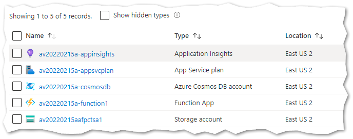

# Azure Function in Python connecting to Cosmos DB

This example shows how to use Terraform to deploy a simple Azure Function in Python that reads and writes data to an existing Cosmos DB.

## Prerequisites

* [Terraform](https://www.terraform.io/downloads)
* [Azure CLI](https://docs.microsoft.com/cli/azure/install-azure-cli)
* [Azure Functions Core Tools version 4.x](https://github.com/Azure/azure-functions-core-tools)

## Azure resources that will be created

Input parameters

* Prefix (unique prefix that will be used for naming resources e.g. av2020215a)
* Location (e.g., eastus2)

Resources that will be created

* Resource group (prefix-rg)
* Storage account (prefixafpctsa1)
* CosmosDB Account SQL Serverless (prefix-cosmosdb)
  * Database (db1)
  * Container (container1)
* App Service Plan Consumption Linux (prefix-appsvcplan)
* Application Insights (prefix-appinsights)
* Function App Linux Python 3.9 (prefix-function1)
  * Application Settings for CosmosDbEndpoint and CosmosDbKey
  * Python 3.9 [function1](./function1/)



## Deploy using Terraform

```bash
cd terraform

terraform init

terraform plan

terraform apply
```

## Invoke HTTP triggered function

```bash
terraform output -raw function_app_default_hostname

curl https://function_app_default_hostname/api/http1?name=Arsen
```
